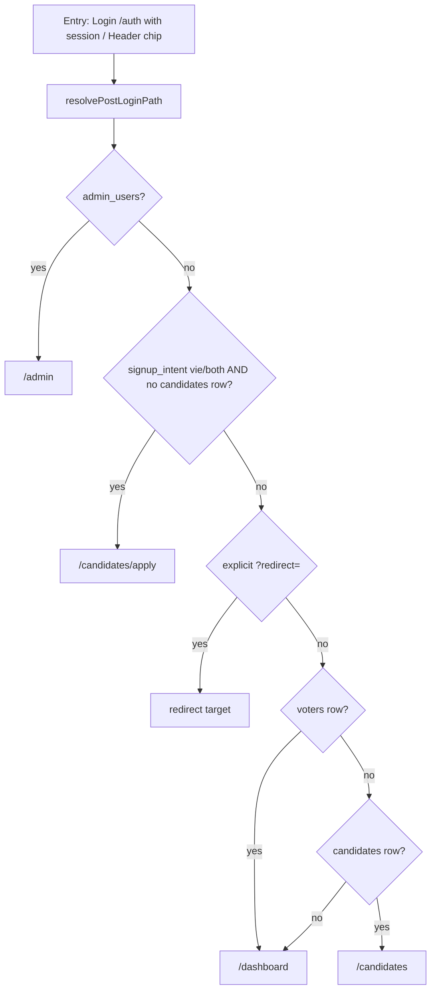
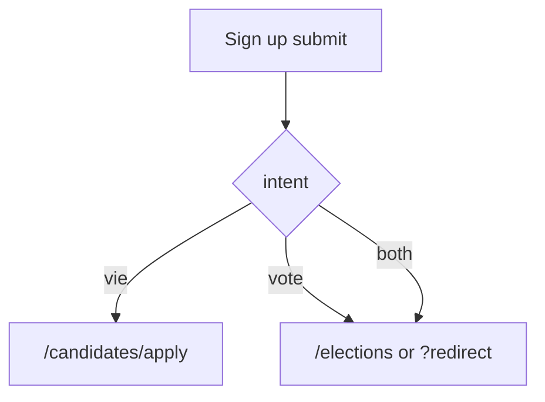

# Auth & session routing

Source of truth for where each user type lands after login, signup, header navigation, and protected-route guards.

Central resolver: [`resolvePostLoginPath`](../src/lib/api/admin-check.ts) in `src/lib/api/admin-check.ts`.

## User personas (what “home” means)

| Persona | Signals | Intended home |
|---|---|---|
| Anonymous | no session | public site; Log in / Sign up |
| Admin | row in `admin_users` | `/admin` |
| Pending candidate | `signup_intent` in `{vie,both}` and **no** `candidates` row | `/candidates/apply` |
| Registered voter | row in `voters` | `/dashboard` |
| Submitted candidate (no voter) | `candidates` row, no `voters` | `/candidates` — not empty dashboard |
| Both (voter + pending apply) | voter + pending vie | `/dashboard` + banner to finish apply |
| Both (voter + submitted) | voter + candidate | `/dashboard` |

**Priority when multiple match:** Admin > Pending vie (no application) > explicit `?redirect=` > Voter dashboard > Candidate list > default `/dashboard`.

## Intended post-login / session-resume flow

## Signup destinations (after account create)

Kept ballot-first for voters; not aligned to login default on purpose.

At signup, `user_metadata` stores:

- `full_name`, `national_id`, `phone` — identity for apply-page prefills
- `signup_intent` — `vote` | `vie` | `both` — abandoned-apply detection

## Sign out

All roles: `signOut` → `/`. Header flips to Log in / Sign up via `onAuthStateChange`.

## Entry points & file map

| Entry | Behaviour | File |
|---|---|---|
| Login submit | `resolvePostLoginPath({ redirect, userId })` | [`src/routes/auth.tsx`](../src/routes/auth.tsx) |
| `/auth` mount with session | same resolver — instant redirect | [`src/routes/auth.tsx`](../src/routes/auth.tsx) |
| Header account chip | `homePath` from resolver (admin chip stays `/admin`) | [`src/components/site-chrome.tsx`](../src/components/site-chrome.tsx) |
| Header Log in | only shown when `authReady && !session`; else chip | [`src/components/site-chrome.tsx`](../src/components/site-chrome.tsx) |
| Dashboard load | no session → `/auth`; admin → `/admin`; pending vie without voter → apply | [`src/routes/dashboard.tsx`](../src/routes/dashboard.tsx) |
| Apply page | no session → `/auth?redirect=/candidates/apply` | [`src/routes/candidates.apply.tsx`](../src/routes/candidates.apply.tsx) |
| Admin routes | unsigned → `/auth?redirect=…`; signed non-admin → `/admin/not-authorized` | [`src/lib/api/admin.ts`](../src/lib/api/admin.ts) `requireAdminLoader` |

## Header states

| State | Chip / CTAs | Chip target | Sign out |
|---|---|---|---|
| Auth loading (`!authReady`) | Support only (no Log in flash) | — | — |
| Signed out | Log in, Sign up | `/auth` | — |
| Voter | name | `homePath` (usually `/dashboard`) | yes |
| Admin (no voter) | Admin | `/admin` | yes |
| Signed-in other | name | `homePath` (`/candidates/apply`, `/candidates`, or `/dashboard`) | yes |

## Abandoned apply detection

`hasPendingVieApplication()` returns true when:

1. `user_metadata.signup_intent` is `vie` or `both`, and
2. no row in `candidates` for `user_id`.

On login → `/candidates/apply` with toast. On dashboard: vie-only users are redirected; “both” users see a finish-application banner.

**Legacy accounts** created before `signup_intent` was stored are not flagged.

## Intentional inconsistencies (out of scope)

- Signup `vote`/`both` lands on `/elections`; login default is `/dashboard` (ballot-first after enroll).
- MFA / TOTP for admins is temporarily disabled (`ADMIN_MFA_ENFORCED`).
- No backfill of `signup_intent` for old users.

## Gaps closed in this pass

1. `resolvePostLoginPath` routes by voter vs submitted-candidate when there is no explicit redirect.
2. Header uses `authReady` + `homePath` so signed-in users never flash Log in, and the account chip goes to the correct home.
3. Removed unused `afterAuth` in `auth.tsx`.
